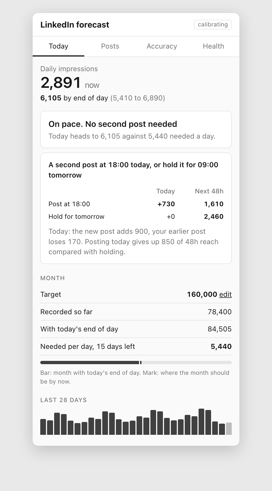
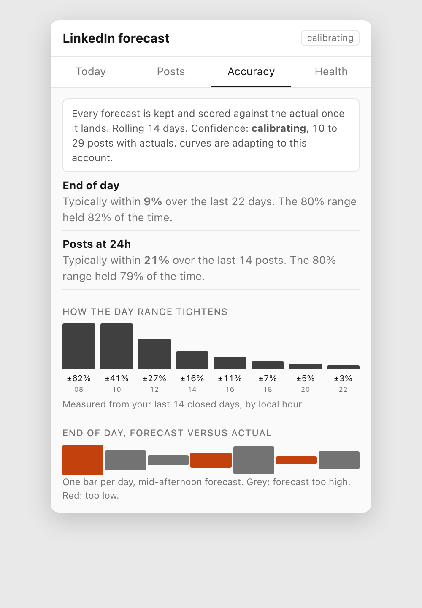

# LinkedIn Impressions Forecast

<p align="center"></p>

A Chrome extension that shows, on LinkedIn itself, where today is heading: your daily impressions by end of day, each post's count by end of day, and whether a second post today is worth it. Local only. Nothing leaves your browser.

## Install (no terminal needed)

Two minutes.

1. Download the latest `linkedin-forecast-<version>.zip` from [Releases](https://github.com/rendeiro/linkedin-forecast/releases).
2. Unzip it. You get a folder with `manifest.json` inside. Keep that folder somewhere permanent; Chrome loads it from there.
3. Open `chrome://extensions` in Chrome.
4. Turn on **Developer mode** (switch in the top right).
5. Click **Load unpacked** and select the unzipped folder.
6. Pin the icon: click the puzzle piece in Chrome's toolbar, then the pin next to "LinkedIn Impressions Forecast".

To update later: download the new zip, unzip it over the same folder, then click the reload icon on the extension's card in `chrome://extensions`.

## First run: give it your history

The extension learns from your own numbers. Two ways to seed it. Do both; the export is what gives day-one accuracy.

**A. Import your LinkedIn export (recommended, 2 minutes)**

1. On LinkedIn open **Analytics** → **Content analytics**, or go straight to `linkedin.com/analytics/creator/content/`.
2. Set the period to **365 days** (top left dropdown), then click **Export** (top right). LinkedIn downloads an `.xlsx` file.
3. Right-click the extension icon → **Options**. Under "Import LinkedIn analytics export", choose that file.
4. The page confirms how many days and posts were imported.

Importing twice is safe: days and posts merge.

**B. Let it read your pages (automatic)**

1. Click the extension icon and press **Open analytics**. The extension reads the daily chart from that page.
2. Press **Read posts now**. It opens each recent post's analytics in a background tab for a few seconds and closes it.
3. Set a monthly target, or skip. Press **Finish setup**.

From then on, every LinkedIn page you open updates the model. With auto-visit on (the default), it also re-reads your analytics every hour and each live post every 30 minutes while Chrome is open. That is automation under LinkedIn's terms even though it only opens your own pages. Turn it off in Options if you would rather not.

## What you see

| | |
|---|---|
|  |  |
| Under each of your posts: `1,017 now · 2,207 by end of day`. Hover for the range and hourly gain. | Popup, Posts: each live post with its curve so far, rising or tail, and its end-of-day count. |
|  |  |
| Popup, Today: the day's number, one call on a second post today versus tomorrow, and the month against your target. | Popup, Accuracy: how wrong past forecasts were, and how the range tightens through the day. |

On the analytics page the chart is replaced by the forecast chart: solid line through completed days, dashed to the end-of-day point, in Daily or Cumulative view and for any period. A "LinkedIn chart" link swaps the original back.

Nudges arrive as Chrome notifications, at most 4 a day and none in quiet hours: one and two hours after you post, a mid-afternoon second-post call on weekdays, a morning plan at 08:00, a scorecard at 09:00.

## How the numbers are made

**Data.** The daily series comes from the analytics chart's own point labels. Post counts come from the impressions figure under each post and from the post analytics page. Every reading is stored with its time in IndexedDB. No LinkedIn API is called.

**Day forecast.** Two estimates, blended. The day curve: today's count divided by the share of the day that is typically done at this hour, shifted to when today's first post actually went out. The posts estimate: today's count plus what each live post still earns before UTC midnight, from its own count and age. The curve's weight grows with how much of the day it has seen. The popup shows both under "How this number is built".

**Post forecast.** Current count plus expected gain until UTC midnight, from the post curve. Never below the current count, because the count only goes up.

**Range.** Measured from your own closed days: the spread between what a reading at this hour implied and where the day ended. Wide in the morning, tight by late afternoon. The Accuracy tab shows it by hour.

**Learning.** Each closed day and each post that passes 24 hours nudges the curves. After 10 posts with actuals the model calls itself `calibrating`, after 30 `fitted`. Only posts with a trustworthy publish time count: LinkedIn's post ids encode the draft time, so the page's "2h" label always wins.

**Privacy.** No backend, no account, no telemetry. Options exports your data as JSON or CSV and imports it back.

## Advanced: build from source

For changing the code or building your own zip. Needs Node 18 or newer.

```bash
git clone https://github.com/rendeiro/linkedin-forecast.git
cd linkedin-forecast
npm install
npm run build
```

Then load the `dist/` folder as an unpacked extension (steps 3 to 5 above).

| Command | What it does |
|---|---|
| `npm run build` | Typecheck, then bundle to `dist/` |
| `npm run watch` | Rebuild on change |
| `npm test` | Vitest: reference vectors, saved-page fixtures, replay |
| `npm run package` | Build and zip `dist/` as `linkedin-forecast-<version>.zip` |
| `./scripts/screenshots.sh` | Regenerate the README screenshots from the mock pages in `docs/demo` |

```
src/content/      content script: URL router, readers (analytics, post summary, feed), overlay
src/background/   service worker: message router, IndexedDB store, engine, auto-visit, nudges
src/model/        pure model, post-id decode, .xlsx export parser
src/ui/           Preact popup and options page
tests/            model vectors, saved-HTML fixtures, replay
```

LinkedIn markup changes without notice. Every selector lives in `src/content/selectors.ts`. The popup's Health tab shows which page type last read successfully, and Options → "Show captured data" has an event log. The original build specification is in [SPEC.md](SPEC.md).
