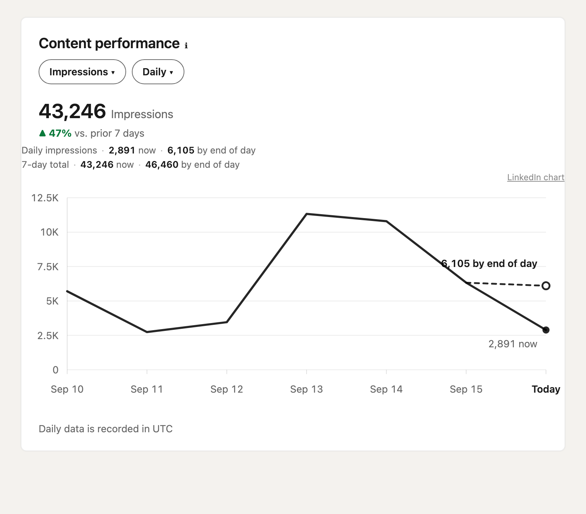
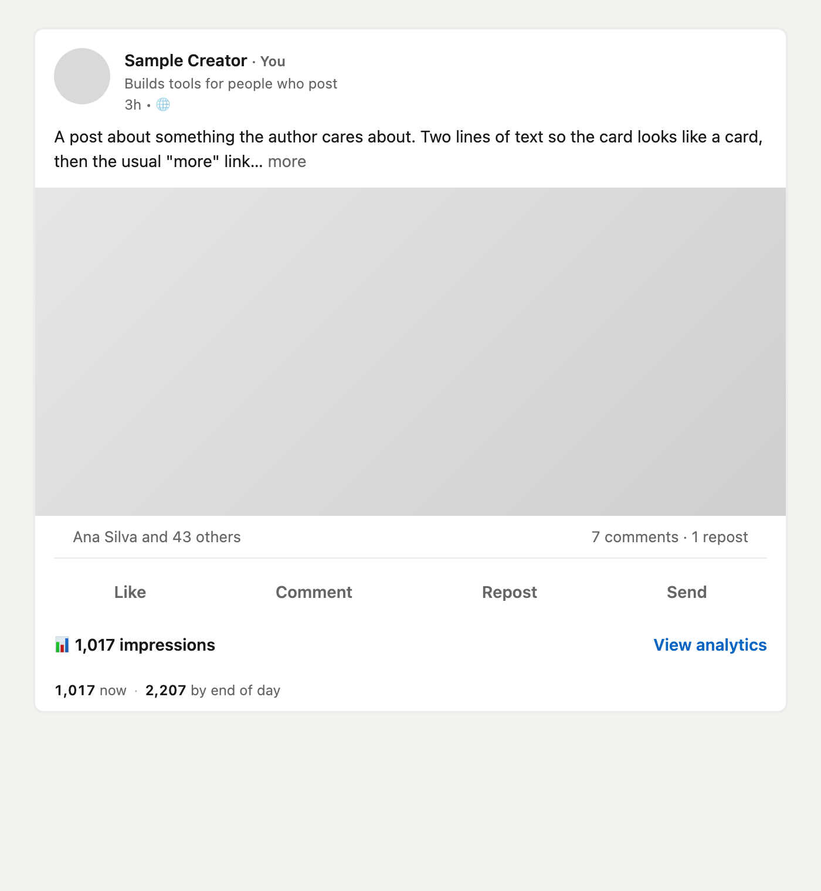
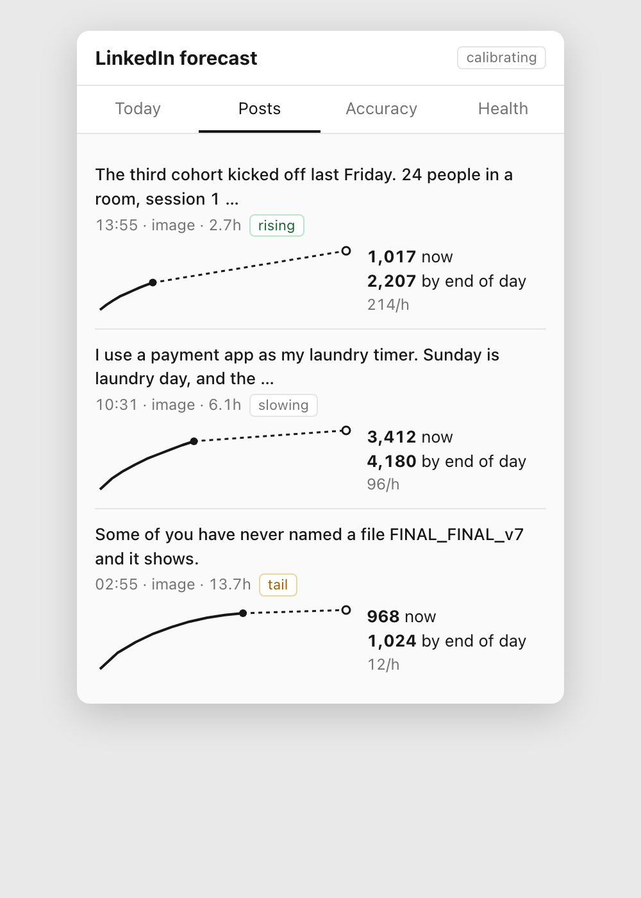

# LinkedIn Impressions Forecast

A Chrome extension that tells you, while you browse LinkedIn, where today is heading: how many impressions your day will close at, and how many each of your posts will have by the end of the day. It reads the numbers LinkedIn already shows you. Nothing leaves your browser.

<p align="center"></p>

## What you get

**One line under each of your posts**

```
845 now · 1,930 by end of day
```

Current impressions, and the count expected at the end of the current UTC day. Hover for the 80% interval, the hourly gain, and the model's confidence level.

**A forecast chart on the analytics page**

The Content analytics card gets a line chart in LinkedIn's style: solid line through the last six days to today's count so far, dashed line to the end-of-day number. Works in Daily and Cumulative view. A small "LinkedIn chart" link swaps LinkedIn's original back in.

**A popup**

- Today: daily impressions so far, end-of-day forecast, pace needed for your goal, last 28 days
- Live: every post younger than 48 hours with its forecast
- Goal: daily or monthly target, pace per day
- Accuracy: how wrong the forecasts have been, by horizon and by post type
- Health: which LinkedIn page types were last read successfully

**Nudges** (Chrome notifications, at most 4 a day, none in quiet hours)

1. One hour after you post: slow, average, or strong start compared with your own history
2. Two hours after: updated end-of-day number when it moved
3. Mid-afternoon on weekdays: whether a second post today is worth it, and what it would add
4. 08:00: yesterday's number and the latest time to post for a normal day
5. 09:00: scorecard, forecast versus actual for yesterday

## Install (unpacked extension)

You need Node 18 or newer and Chrome.

```bash
git clone https://github.com/rendeiro/linkedin-forecast.git
cd linkedin-forecast
npm install
npm run build
```

Then in Chrome:

1. Open `chrome://extensions`
2. Turn on **Developer mode** (switch in the top right)
3. Click **Load unpacked**
4. Pick the `dist/` folder inside the cloned repo
5. Pin the extension icon, click it, press **Open analytics**

Setup takes under three minutes: the analytics page gives the daily series, your recent posts get one reading each, and you answer one question about your goal.

To update later: `git pull`, `npm run build`, then click the reload icon on the extension card in `chrome://extensions`.

## How the forecast works

**Data.** The extension reads three things from pages you open: the daily impressions series on the analytics page (from the chart's accessibility labels, since LinkedIn no longer ships the data payload), the impression count under each of your posts, and the "N impressions" figure on a post's analytics page. Every reading is stored with a timestamp in IndexedDB. Nothing is sent anywhere. No LinkedIn API is called.

**Two curves.** Impressions follow a repeatable shape. A post earns about 18% of its 24-hour total in the first hour, 30% by hour two, 63% by hour six. A day's impressions accumulate along a similar curve keyed to the hour in UTC. The extension starts from prior curves and adjusts them as your own actuals arrive: each closed day and each post that passes 24 hours nudges the curve toward what happened. After 10 posts it labels itself `calibrating`, after 30 `fitted`.

**Post forecast.** Current count plus the gain expected between now and UTC midnight, read off the post curve and scaled to your account's typical post. The forecast can never sit below the current count: the count only goes up, so any number lower than what is on screen would be a contradiction, not a forecast.

**Day forecast.** Today's count so far divided by the share of the day the curve says is done. Before 06:00 UTC the share is too small to divide by, so the line says "estimate from 06:00 UTC" instead of printing a wild number.

**Publish time.** A post's URN encodes the moment the share was created, which for drafts and scheduled posts is hours before it went live. The page's relative label ("2h") always wins. A post whose time is not confirmed by a label or an early reading is excluded from learning.

**Honesty about accuracy.** Intraday numbers are where the value is: the day forecast is usually within 10% by mid-afternoon. Day-ahead numbers run 25 to 35% off because post quality is unknown before the first reading. The Accuracy tab keeps score, and the interval width auto-adjusts if coverage drifts from 80%.

## Auto-visit

By default the extension opens your own analytics pages in background tabs on a schedule (analytics hourly, live posts every 30 minutes, forced reads 55 and 115 minutes after a new post). This is automation under LinkedIn's terms even though it only touches your own pages. It is capped at 60 visits a day, backs off when a read fails, and never runs in quiet hours. Turn it off in Options if you would rather log readings only as you browse.

## Screenshots

| | |
|---|---|
|  |  |
| Line under a post on the activity page | Popup, Live tab |

## Develop

| Command | What it does |
|---|---|
| `npm run build` | Bundle to `dist/` with esbuild |
| `npm run watch` | Rebuild on change |
| `npm test` | Vitest: reference vectors, payload and DOM fixtures, replay |
| `npm run typecheck` | `tsc --noEmit` |

```
src/content/      content script: URL router, readers (analytics, post summary, feed, notifications), overlay
src/background/   service worker: message router, IndexedDB store, engine, auto-visit, nudges
src/model/        pure model, URN decode, .xlsx export parser
src/ui/           Preact popup and options page
tests/            model vectors, saved-HTML fixtures, replay
```

LinkedIn markup changes without notice. Every selector lives in `src/content/selectors.ts`, and the popup's Health tab shows which page type last read successfully. The full build specification is in [SPEC.md](SPEC.md).

## Privacy

Local only. No backend, no account, no telemetry, no requests to any host other than the LinkedIn pages your browser opens. Options page exports your data as JSON or CSV and imports it back.
